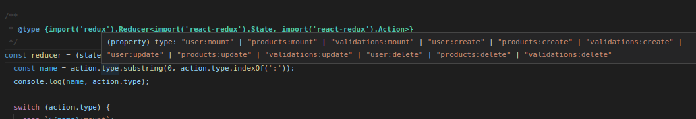
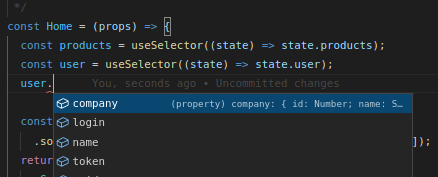

- This project was bootstrapped with [Create React App](https://github.com/facebook/create-react-app).

## why typings root


mainly, 
we need to rewrite types of some libs so that they work correctly...

- .d.ts declaration files will always help in vscode intellisense.



## consume Api services

all API's only return statuscode, reducer values ​​are updated by websocket
when the client sends a request, in the header it has a socket-id, the server will send 'dispatch' to that id, allowing real-time batch updates.

the bearer token in your header is also mandatory.

## web socket

whenever establishing a new connection, the token-id must be updated, and the authorization token sent back to the server.

the server will most of the time send a standard event called 'dispatch', which works directly inside the reducer

### Code Structure

```php
├── @types // linked to dev dependencies
    └── index.d.ts
├── public
    ├── icons
        └── favicon.ico        
    ├── index.html
    └── manifest.webmanifest
├── src
    ├── components
        ├── AwesomeComponent
            └── index.js
    ├── contexts
        ├── Pwa.js
        ├── Themed.js
        ├── ReduxStore.js
        └── WebSocket.js
    ├── hooks
        └── useMyCustomHook.js
    ├── pages
        ├── Home
            └── index.js
        ├── Menu
            └── index.js
        └── app.js
    ├── reducers
        ├── index.js
        └── store.js
    └── users.js
└── package.json
```

### Generate a self-signed certificate

- make sure to create certificates outside projects on folder <i>.cert</i>
<pre>
<b style="color: green; font-size: 9px">~/Projects/cvdev/web</b> cd ..
<b style="color: green; font-size: 9px">~/Projects/cvdev</b> mkdir .cert
<b style="color: green; font-size: 9px">~/Projects/cvdev/web</b> cd .cert
</pre>

- commands to create certificate in linux in <i>/.cert</i> dir
<pre>
<b style="color: green; font-size: 9px">~/Projects/cvdev/.cert</b> openssl genrsa -out key.pem
<b style="color: green; font-size: 9px">~/Projects/cvdev/.cert</b> openssl req -new -key key.pem -out csr.pem
<b style="color: green; font-size: 9px">~/Projects/cvdev/.cert</b> openssl x509 -req -days 9999 -in csr.pem -signkey key.pem -out cert.pem
<b style="color: green; font-size: 9px">~/Projects/cvdev/.cert</b> rm csr.pem
</pre>

- share certificates between web and server